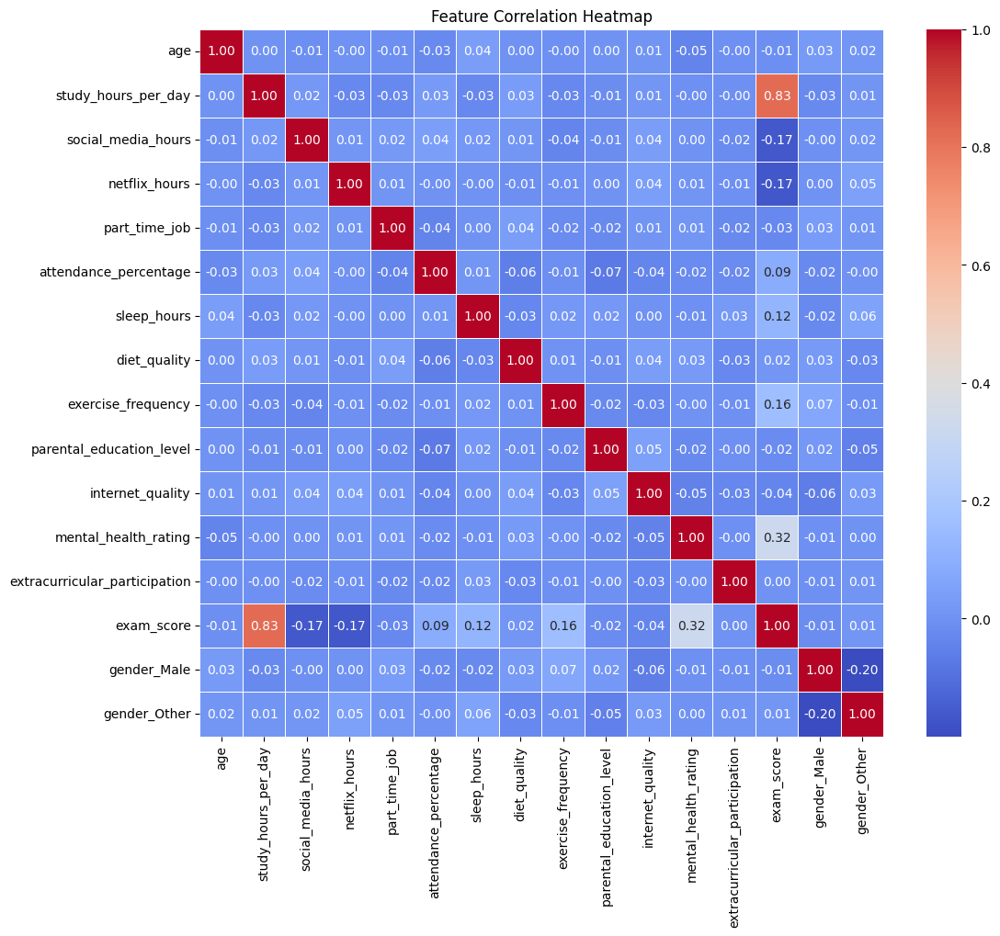
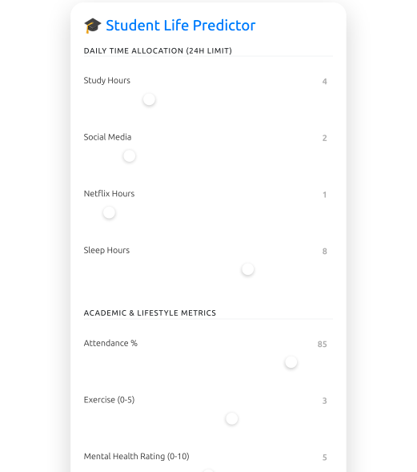
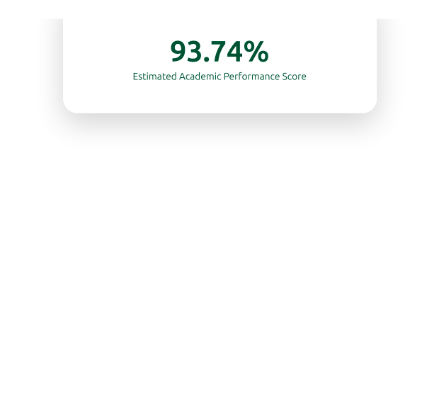

[](https://github.com/Rasel1435/academic-performance-predictor/actions)

# Academic Performance Predictor


> A machine learning pipeline designed to analyze student behavioral data and predict academic outcomes. Features data preprocessing, exploratory analysis, and high-accuracy predictive modeling.

## 🚀 Quick Start (No Setup Required)
The fastest way to try this app is using **Docker**. You don't need to install Python or any libraries; just run this command:

```bash
docker run -p 8000:8000 rasel143x/student-predictor:latest
```
**Access the app at:** http://localhost:8000

## 📌 Project Overview
This project investigates the correlation between daily student habits—such as study hours, sleep patterns, and extracurricular involvement—and cumulative academic performance. By leveraging Machine Learning algorithms, the project identifies the most influential behavioral predictors of success, achieving a **90% accuracy rate** in performance classification. This tool serves as a proof-of-concept for early-intervention systems in educational institutions.

## 🏗️ DevOps & Automation
This project is fully automated using **CI/CD (Continuous Integration/Continuous Deployment):**
-   **Automated Builds:** Every time code is pushed to this repository, **GitHub Actions** automatically builds a new Docker image.
-   **Cloud Registry:** The fresh image is pushed to **Docker Hub** instantly, ensuring the latest tag always has the newest features.
-   **Environment Consistency:** Docker ensures the app runs exactly the same on your machine as it does on mine.


## 🛠️ Tech Stack
-   **Language:** Python
-   **Backend:** FastAPI
-   **ML Libraries:** Scikit-Learn, XGBoost, Pandas, NumPy
-   **DevOps & Deployment:** Docker, Docker Hub, GitHub Actions
-   **Tools:** Jupyter Notebook, Git, Pip-tools


## 🚀 Key Features
* **Behavioral Analysis:** Quantified the impact of non-academic factors (sleep, social habits, etc.) on GPA.
* **Predictive Modeling:** Implemented and optimized **XGBoost** to reach a 90% accuracy threshold.
* **Actionable Data:** Visualized key "habit thresholds" required for high-tier academic performance to provide data-driven student coaching.


## ⚙️ Installation & Setup
This project uses a modern **src-layout** and `pyproject.toml` for dependency management.

### 1. Clone the Repository
```bash
git clone https://github.com/Rasel1435/academic-performance-predictor.git
cd academic-performance-predictor
```
## 2. Set Up Virtual Environment
```bash
python3 -m venv .venv
source .venv/bin/activate  # On Windows use: .venv\Scripts\activate
```

## 3. Install Dependencies
Install the project in **editable mode** so changes to the ```src/``` directory are reflected immediately:

```bash
pip install -e .
```

## 4. (Optional) Development Tools
To modify dependencies or regenerate the lock file:

```bash
pip install pip-tools
pip-compile pyproject.toml --output-file=requirements.txt
```

```bash
pip list | grep academic-performance-predictor
```

## 🎮 How to Use
Run the main entry point to access the interactive menu:
```bash
python main.py
```

From the menu, you can:

1.  **Train Model**: Runs the full ETL pipeline and saves the artifacts to ```/models```.
2.  **Make Prediction**: Enter your daily habits to get an estimated exam score.

## 📊 Model Performance
The pipeline evaluates multiple models (Linear Regression, Random Forest, XGBoost) and selects the "Champion" based on R² score.
* **Champion Model:** Linear Regression
* **R² Score:** 0.8996 (Explains ~90% of the variance in exam scores)
* **Mean Absolute Error (MAE):** 4.11 (Average prediction error of ±4.11 points)

## 🏆 Model Selection Logic
During the evaluation phase, the pipeline compared **Linear Regression, Random Forest**, and **XGBoost**.

-   **Linear Regression** was selected as the **Champion Model** because the relationship between habits (like Study Hours) and Exam Scores turned out to be largely linear in this dataset, yielding the highest accuracy.

-   **XGBoost** was included in the pipeline to account for potential **diminishing returns** (e.g., where studying 20 hours a day might actually lower a score due to exhaustion). While XGBoost is more powerful for complex datasets, the simplicity of Linear Regression provided the best fit for this specific academic data.

## 🖼️ Data Insights
During the Exploratory Data Analysis (EDA) phase, the pipeline automatically generates visualizations to uncover relationships within the student data.

### Feature Correlation
The heatmap below reveals that **Attendance %** and **Study Hours** have the strongest positive impact on the final exam score, while excessive **Social Media** and **Netflix** usage show a negative correlation.



> **Pro Tip:** You can find all generated analysis plots in the `results/plots/` directory after running the ETL pipeline.


## 🧠 Features Used for Prediction
The model utilizes the 8 most influential behavioral predictors identified during feature selection:
* **Academic:** Study Hours/Day, Attendance %
* **Health:** Sleep Hours, Mental Health Rating (1-10), Exercise Frequency (1-5)
* **Lifestyle:** Social Media Hours, Netflix Hours
* **Target:** Exam Score (0-100)


## 🌐 Web Interface


In addition to the CLI, the project features a modern web dashboard built with **FastAPI**.

### 🚀 Real-time Predictions
The model processes habits instantly to provide a performance score.


- **The 24-Hour Balance Rule**: Built-in validation ensuring daily activities do not exceed 24 hours.
- **Glassmorphism Design**: A premium aesthetic with dynamic result animations.

### 📄 Professional Reporting
The application generates a multi-page, print-optimized document that automatically hides interactive UI elements for a clean, professional aesthetic.

| Page 1: Input Summary | Page 2: Final Prediction |
| :--- | :--- |
|  |  |

* **Multi-Page Precision**: The CSS logic ensures that the report is split logically, keeping your data clean and easy to read.
* **Export as PDF**: Users can instantly save this view as a high-quality **.pdf** file through the "Download PDF Report" action.

- **One-Click Reports**: Export your prediction as a print-friendly PDF.


## Running the Web App
```bash
# Using your new shortcut script
./run.sh

# Or manually via uvicorn
uvicorn src.web.api:app --reload
```

## 📈 Model Insights & Logic
**Why XGBoost?**

While the pipeline identified **Linear Regression** as a strong performer for this specific dataset, the XGBoost implementation provides superior handling of non-linear relationships, such as the point where "Netflix Hours" start to exponentially degrade "Study Efficiency."


## 🔮 Future Roadmap
To further enhance this "Academic Early-Intervention System," the following features are planned:

-   **User Authentication**: Allow students to create accounts and track their performance trends over time.

-   **Database Integration**: Store historical predictions in **PostgreSQL** or **MongoDB** to generate progress charts.

-   **Personalized Coaching AI**: Use an LLM (like Gemini or GPT) to provide specific advice based on the prediction (e.g., "If you shift 1 hour of Netflix to Sleep, your predicted score increases by 5%").

-   **API Documentation**: Full Swagger/OpenAPI documentation for third-party educational tools to consume the prediction engine.


## 🤝 Contact & Contribution
Created by [Sheikh Rasel Ahmed].

-   **LinkedIn**: [Sheikh](https://www.linkedin.com/in/shekhnirob1)

-   **Portfolio**: [Website](https://rasel1435.github.io/Sheikh-Rasel-Ahmed-Resume/)

Contributions, issues, and feature requests are welcome! Feel free to check the issues page.
